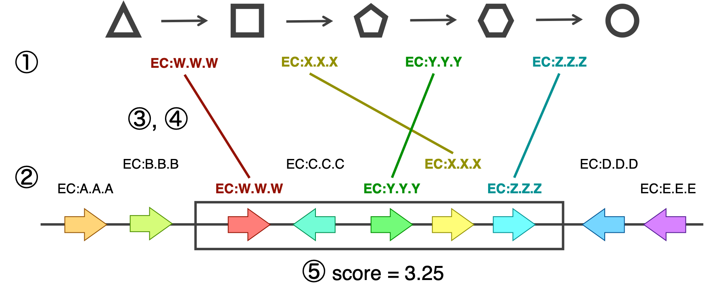

# metadigzyme

metadigzyme working directory


## Quick Start

```bash
docker run metagigzyme
```

## 概要

metadigzyme は、一連の代謝反応モジュールについて、細菌ゲノム中の対応するオペロン遺伝子群を推定する。

metadigzyme では、以下の仮説に基づいて、遺伝子を推定する。

- 代謝反応モジュールを担う酵素遺伝子群は、細菌ゲノム中においてオペロン（遺伝子クラスター）を形成している


## アルゴリズム



1. 代謝反応モジュールの各反応のEC番号を取得
2. 細菌ゲノム中の各酵素遺伝子のEC番号を取得
3. 代謝反応モジュールの反応と酵素遺伝子のEC番号を照合し、ゲノム中で代謝反応モジュールが集中して存在している領域（主オペロン）を探索
4. 主オペロンに含まれなかった反応に対し、3.と同様にしてサブオペロンを繰り返し探索
5. 発見されたオペロン遺伝子群に対し、スコアを計算


## 使い方
